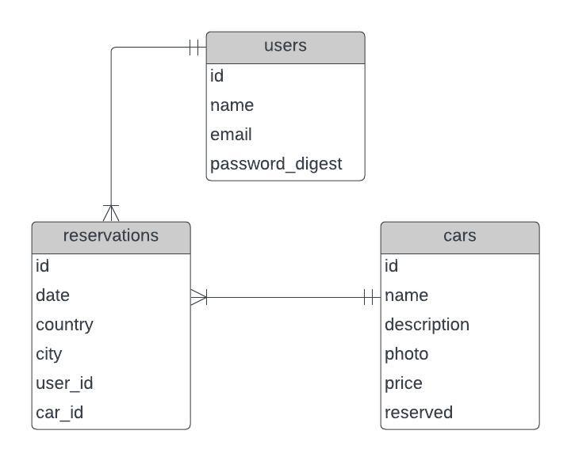
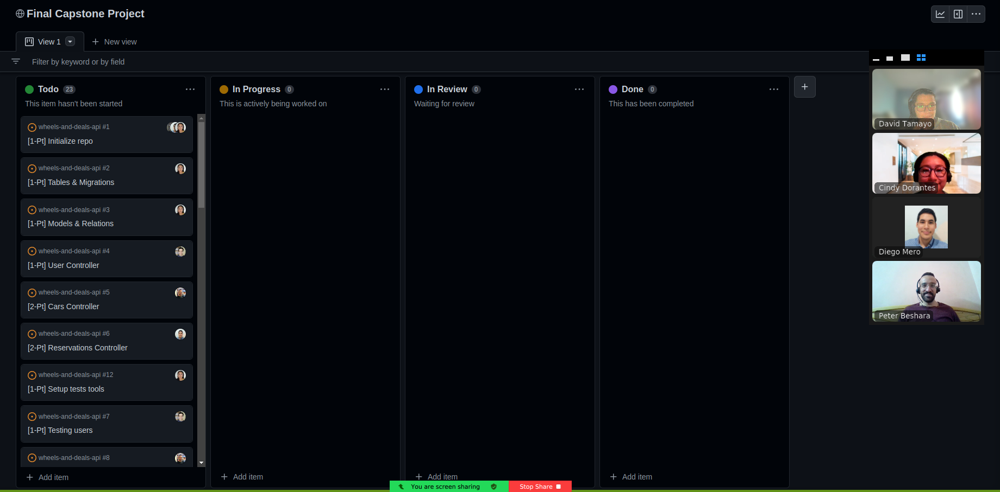
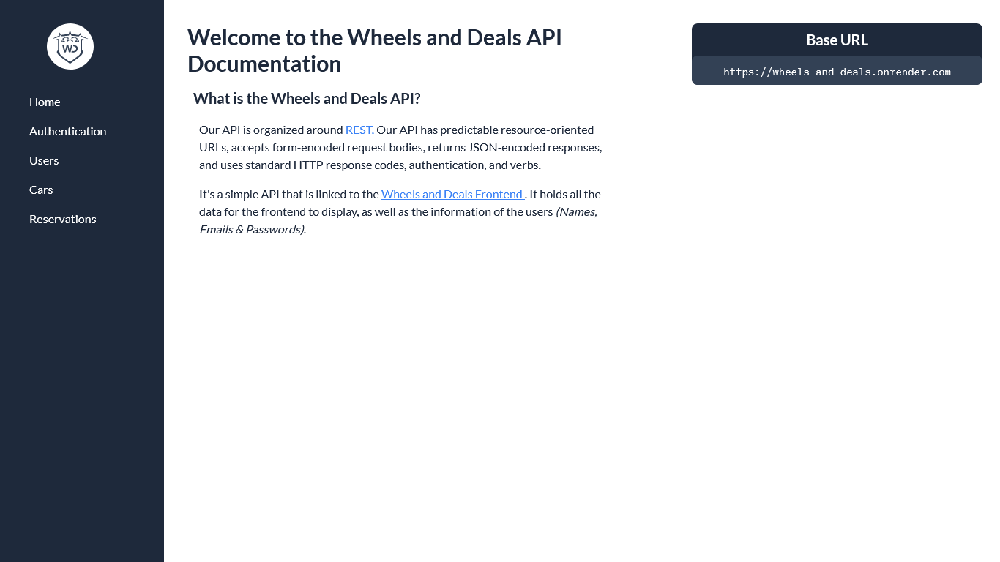
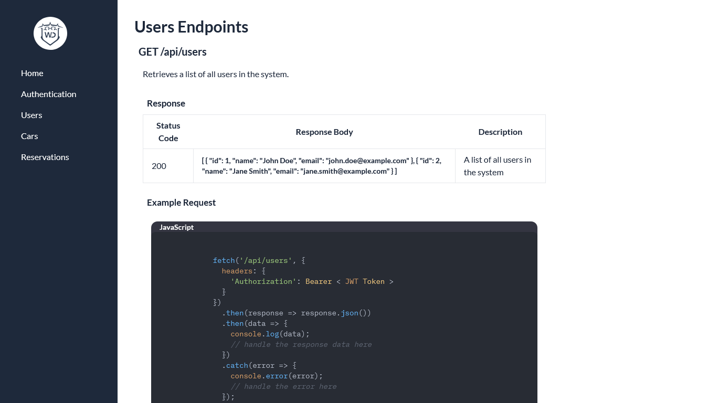

<a name="readme-top"></a>


<div align="center">
  
  <br/>

  <h2><b>WHEELS AND DEALS API: RAILS BACK-END </b></h2>
  <br/>
</div>

<!-- TABLE OF CONTENTS -->

# Table of Contents 📑

- [📖 About the Project](#about-project)
  - [🛠 Built With](#built-with)
    - [Tech Stack](#tech-stack)
    - [Entity Relationship Database](#erd)
    - [Key Features](#key-features)
  - [📅 Project Kanban Board](#kanban-board)
  - [🚀 Live Demo](#live-demo)
- [📷 Documentation Screenshots](#documentation-ss)
- [💻 Getting Started](#getting-started)
  - [Setup](#setup)
  - [Prerequisites](#prerequisites)
  - [Install](#install)
  - [Usage](#usage)
  - [Run tests](#run-tests)
- [👥 Authors](#authors)
- [🤝 Contributing](#contributing)
- [⭐️ Show your support](#support)
- [🙏 Acknowledgements](#acknowledgements)
- [📝 License](#license)
<br/><br/>

<!-- PROJECT DESCRIPTION -->

# 📖 WHEELS AND DEALS: REACT FRONT-END <a name="about-project"></a>

> **Wheels and Deals API** is organized around REST. Our API has predictable resource-oriented URLs, accepts form-encoded request bodies, returns JSON-encoded responses, and uses standard HTTP response codes, authentication, and verbs.

> It's a simple API that is linked to the [Wheels and Deals Frontend](https://github.com/Peter1907/wheels-and-deals-react/) . It holds all the data for the frontend to display, as well as the information of the users (Names, Emails & Passwords)

<br/>

## 🛠 Built With <a name="built-with"></a>

### Tech Stack <a name="tech-stack"></a>

<details>
  <summary>Client</summary>
  <ul>
    <li><a href="https://rubyonrails.org/"></a></li>
    <li><a href="https://tailwindcss.com/"></a></li>
  </ul>
</details>

<details>
  <summary>Server</summary>
  <ul>
    <li><a href="https://render.com/"></a></li>
  </ul>
</details>

<details>
<summary>Database</summary>
  <ul>
    <li><a href="https://www.postgresql.org/"></a></li>
  </ul>
</details>

<details>
  <summary>Authentication</summary>
  <ul>
    <li><a href="https://jwt.io/"></a></li>
  </ul>
</details>
<br/>

<!-- ERD -->

### Entity Relationship Database <a name="ERD"></a>

<br/>


<p align="right">(<a href="#readme-top">back to top</a>)</p>

<!-- Features -->

### Key Features <a name="key-features"></a>

- Authentication Endpoints: POST
- Users Endpoints: GET, POST
- Cars Endpoints: GET, POST, DELETE
- Reservations Endpoints: GET, POST, DELETE
- Documentation available [here](https://wheels-and-deals.onrender.com)

<p align="right">(<a href="#readme-top">back to top</a>)</p>

## 📅 Project's Kanban Board <a name="kanban-board"></a>

Kanban Board available [here](https://github.com/users/Peter1907/projects/3/views/1) 

The team of developers involved in the creation of this project is made up of 4 [authors](#authors).



<br/>

<!-- LIVE DEMO -->

## 🚀 Live Demo <a name="live-demo"></a>

- [Live Demo Link](https://wheels-and-deals.onrender.com)

<p align="right">(<a href="#readme-top">back to top</a>)</p>

## 📷 Documentation Screenshots <a name="documentation-ss"></a>

  
  

<br/>

<p align="right">(<a href="#readme-top">back to top</a>)</p>

<!-- GETTING STARTED -->

## 💻 Getting Started <a name="getting-started"></a>

To get a local copy up and running, follow these steps.

### Prerequisites

In order to run this project you need:

```sh
   gem install rails
```


### Setup

Clone this repository to your desired folder:

```sh
  cd my-folder
  git clone https://github.com/Peter1907/wheels-and-deals-api.git
```

### Install

Install this project with:

```sh
  cd wheels-and-deals-api
  bundle install
```

### Usage

To run the project, execute the following command:

```sh
  rails db:create
  rails db:migrate
  rails s
```

### Run tests

To run tests:
- Remove `config/master.key` and `config/credentials.yml.enc`
- Run:

```sh
  EDITOR=code rails credentials:edit
```
This command will create a new `master.key` and `credentials.yml.enc` if they do not exist
- Then run the following command:

```sh
  bin/rails spec
```

<p align="right">(<a href="#readme-top">back to top</a>)</p>

<!-- AUTHORS -->

## 👥 Authors <a name="authors"></a>

 👤 **Cindy Dorantes**

- GitHub: [@CindyDorantes](https://github.com/CindyDorantes)
- Twitter: [@CindyDorantes10](https://twitter.com/CindyDorantes10)
- LinkedIn: [Cindy Melisa Dorantes Sánchez](https://www.linkedin.com/in/cindydorantessanchez/)

👤 **David Tamayo**

- GitHub: [@IngDavidTM](https://github.com/IngDavidTM)
- Twitter: [@David5TM](https://twitter.com/David5TM)
- LinkedIn: [David Tamayo](https://www.linkedin.com/in/ing-david-tamayo)

👤 **Diego Mero**

- GitHub: [@DiegoMero](https://github.com/DiegoMero)
- Twitter: [@Dimero18](https://twitter.com/Dimero18)
- LinkedIn: [Diego Mero](https://www.linkedin.com/in/diego-mero/)

👤 **Peter Beshara**

- GitHub: [@Peter1907](https://github.com/Peter1907)
- Twitter: [@Peter_Beshara_](https://twitter.com/Peter_Beshara_)
- LinkedIn: [Peter Beshara](https://www.linkedin.com/in/peter-beshara-b33681241/)

<p align="right">(<a href="#readme-top">back to top</a>)</p>

<!-- CONTRIBUTING -->

## 🤝 Contributing <a name="contributing"></a>

Contributions, issues, and feature requests are welcome!

Feel free to check the [issues page](../../issues/).

<p align="right">(<a href="#readme-top">back to top</a>)</p>

<!-- SUPPORT -->

## ⭐️ Show your support <a name="support"></a>

Give a ⭐️ if you like this project!
Also, you can reach out any [author](#authors), we will be glad to hear you.

<p align="right">(<a href="#readme-top">back to top</a>)</p>

<!-- ACKNOWLEDGEMENTS -->

## 🙏 Acknowledgments <a name="acknowledgements"></a>

- Thanks to our learning partners for their help and support.

<p align="right">(<a href="#readme-top">back to top</a>)</p>

<!-- LICENSE -->

## 📝 License <a name="license"></a>

This project is [MIT](./LICENSE) licensed.


<p align="right">(<a href="#readme-top">back to top</a>)</
